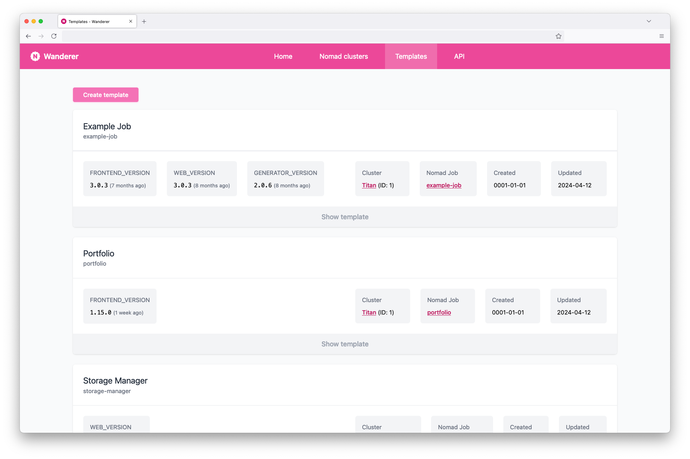
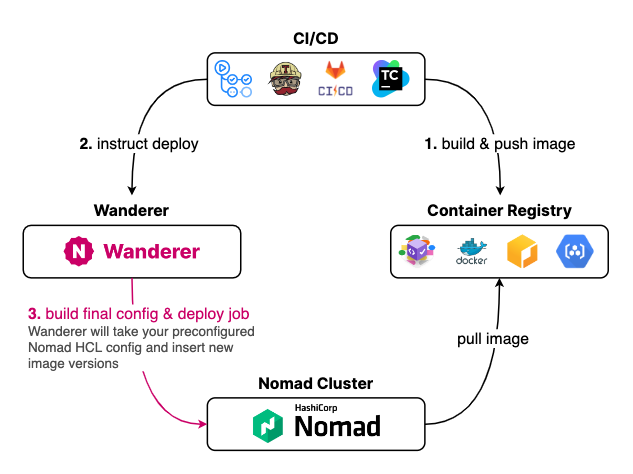

<p align="center">
  
</p>

Wanderer is a **deployment manager** for [HashiCorp **Nomad**](https://www.nomadproject.io/) for **automated deployments** of new job versions via **CI/CD pipelines**.

## Features

- Provides a **centralized repository** for Nomad HCL templates
- Offers **API** for CD tools to automate deployment of new versions
- Simple **Web UI** for editing templates & monitoring deployments
- Supports Nomad instances behind **Cloudflare Access Zero Trust** network
- [**GitHub Actions Workflow**](https://github.com/romanzipp/Wanderer-Action) available for easy pipeline integration

See [**Development Project**](https://github.com/users/romanzipp/projects/2/views/1) for more details.

Built with [Go](https://go.dev/), [Tailwind CSS](https://tailwindcss.com/) and [SQLite](https://sqlite.org/). Contains 0 lines of JavaScript 👀



## Usage



As shown in the diagram above, Wanderer acts as a deployment manager between your CI/CD pipeline and your Nomad cluster. 
The build pipeline will instruct Wanderer to deploy a new version of a job, after which the predefined job template will be injected with the currently tagged version.
Wanderer also supports multiple versions in one template, for example a web project with an API backend `BACKEND_VERSION` and a frontend `FRONTEND_VERSION`.

### Nomad Job Templates

The predefined [Nomad HCL templates](https://developer.hashicorp.com/nomad/docs/job-specification) need to contain **version selectors** in the following syntax: `{{ VERSION_NAME }}`

#### Example Job

The following job defined a `BACKEND_VERSION` which will be replaced by the actual version during deployment by Wanderer.

```hcl
job "my-service" {
  type = "service"

  group "backend" {
    task "app" {
      driver = "docker"
      config {
        image = "my-service:{{ BACKEND_VERSION }}"
      }
    }
  } 
}
```

You can also define the version selectors in the [`meta` block](https://developer.hashicorp.com/nomad/docs/job-specification/meta) for more structure.

```hcl
job "my-service" {
  type = "service"
  meta {
    version_backend = "{{ BACKEND_VERSION }}"
    version_frontend = "{{ FRONTEND_VERSION }}"
  }

  group "backend" {
    task "app" {
      driver = "docker"
      config {
        image = "my-service/backend:{{ env "NOMAD_META_version_backend" }}"
      }
    }
  }

  group "frontend" {
    task "app" {
      driver = "docker"
      config {
        image = "my-service/frontend:{{ env "NOMAD_META_version_frontend" }}"
      }
    }
  }
}
```

## Deploy Wanderer via Docker

```
docker pull ghcr.io/romanzipp/wanderer:latest
```

See [repository](https://github.com/romanzipp/Wanderer/pkgs/container/wanderer) for more information.

### Local

#### Build

```shell
docker build -t wanderer:latest .
```

#### Run

```shell
docker run \
  -v "$(pwd)/data/:/app/data/" \
  -v "$(pwd)/.env:/app/.env" \
  -p 8080:8080 \
  wanderer:latest
```

### On Nomad via Docker

You can also just deploy Wanderer via Nomad itself.

```hcl
job "wanderer" {
  type = "service"
  
  group "wanderer" {
    network {
      mode = "bridge"

      port "http" {
        to = 8080
      }
    }

    service {
      name = "wanderer"
      port = "http"
    }

    task "wanderer" {
      driver = "docker"

      config {
        image   = "ghcr.io/romanzipp/wanderer:1.3.0"
        ports   = ["http"]
        volumes = [
          "local/.env:/app/.env"
        ]

        mount {
          type     = "bind"
          target   = "/app/data/"
          source   = "/opt/wanderer/data/"
          readonly = false
          bind_options {
            propagation = "rshared"
          }
        }
      }

      template {
        destination = "local/.env"
        change_mode = "restart"
        data        = <<-EOH
        APP_PASSWORD=supersecret
        SESSION_LIFETIME=43200
        EOH
      }

    }
  }
}

```

## API

### Authentication

**Header**: `Authorization: <token>`

## Development

### Requirements

- Go 1.19+
- Yarn
- _Docker_

### Go app

#### Install dependencies

```
go get
```

#### Build & hot reload

```shell
gow -e=go,html run .
```

### Frontend

#### Install dependencies

```
npm install
```

#### Build & hot reload

```shell
npm run watch
```

## License

Released under the [MIT License](LICENSE.md).

## Authors

- [Roman Zipp](https://github.com/romanzipp)
