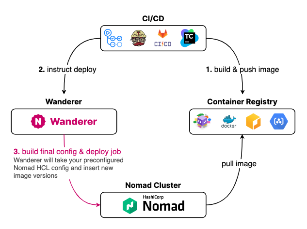

<p align="center">
  
</p>

⚠️ This project is a work in progress ⚠️ See [**Development Project**](https://github.com/users/romanzipp/projects/2/views/1) for more details.

## Features

- Provides a centralized repository for Nomad HCL templates
- Offers API for CD tools to automate deployment of new versions
- Simple Web UI for editing templates & monitoring deployments
- Supports Nomad instances behind Cloudflare Access Zero Trust network
- [**GitHub Actions Workflow**](https://github.com/romanzipp/Wanderer-Action) available for easy pipeline integration

Built with [Go](https://go.dev/), [Tailwind CSS](https://tailwindcss.com/) and [SQLite](https://sqlite.org/).



## Docker

```
docker pull ghcr.io/romanzipp/wanderer:latest
```

See [repository](https://github.com/romanzipp/Wanderer/pkgs/container/wanderer) for more information.

### Local

#### Build

```shell
docker build -t wanderer:latest .
```

#### Run

```shell
docker run \
  -v "$(pwd)/data.db:/data.db" \
  -v "$(pwd)/.env:/.env" \
  -p 8080:8080 \
  wanderer:latest
```

## API

### Authentication

**Header**: `Authorization: <token>`

## Development

### Requirements

- Go 1.19+
- Yarn
- _Docker_

### Go app

#### Install dependencies

```
go get
```

#### Build & hot reload

```shell
gow -e=go,html run .
```

### Frontend

#### Install dependencies

```
yarn install
```

#### Build & hot reload

```shell
yarn watch
```

## License

Released under the [MIT License](LICENSE.md).

## Authors

- [Roman Zipp](https://github.com/romanzipp)
